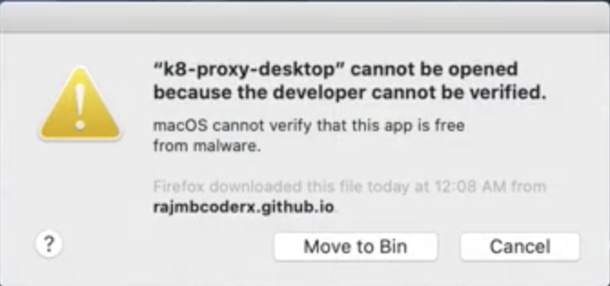
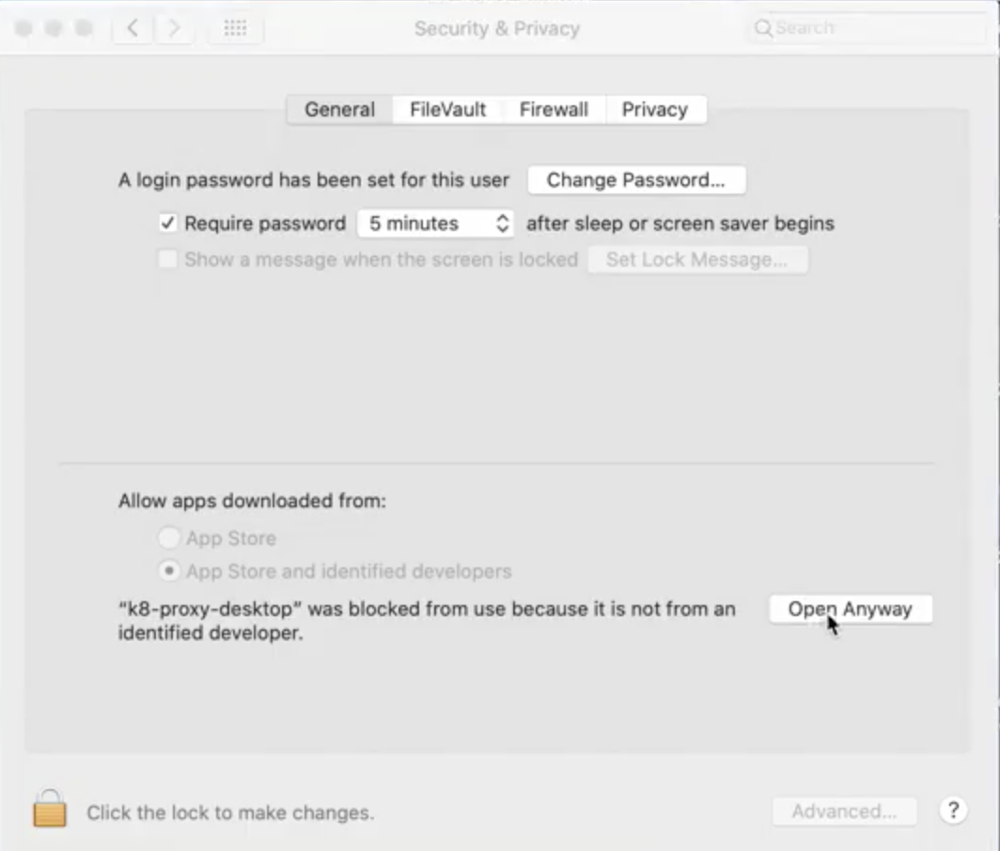
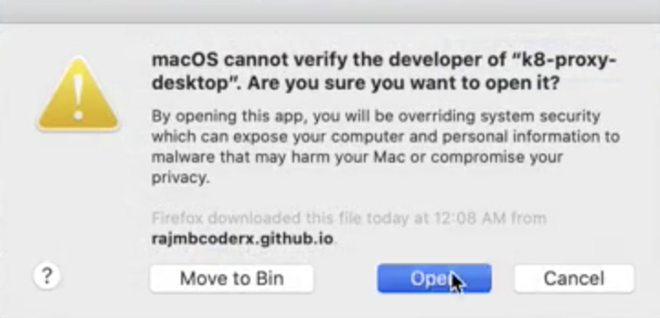
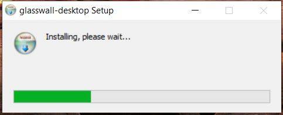
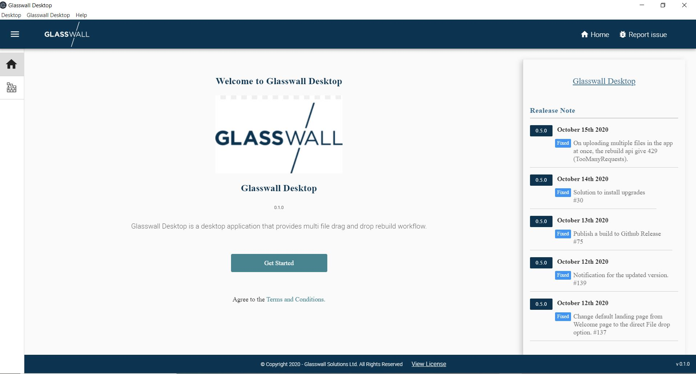
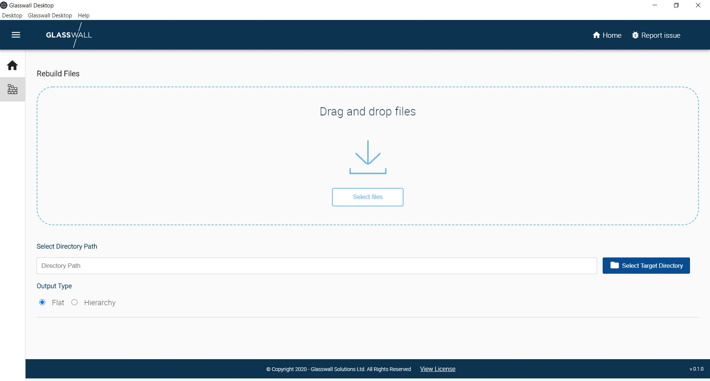
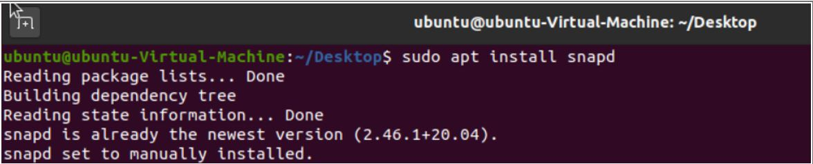
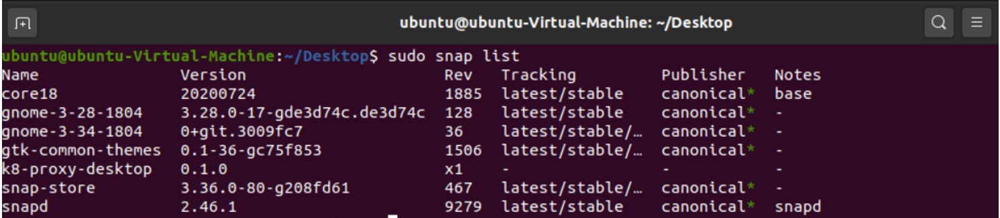
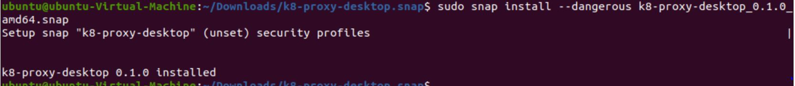
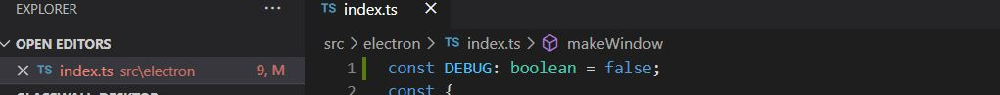

# Glasswall Desktop

Glasswall Desktop is a desktop application that provides multi file drag and drop rebuild workflow.

## Membership

| Avatar | Name | Role | Time Zone |
| -------------------------------------------|----------------------|----------------------------| -------- |
|   | Virendra Vaishnav [@b24repo](https://github.com/b24repo) | Delivery Manager | IST |
|   | Sanchit Garg [@rajmbcoderx](https://github.com/rajmbcoderx) | Member | IST |
|   | Mudit Gupta [@gmuditdce](https://github.com/gmuditdce) | Member | IST |
|   | Sudhidh Kumar [@kumarsudhish](https://github.com/kumarsudhish) | Member | IST |

## Current Objective and Key Results
**Objective:**
1. Just drag and drop the files from your local hard disk, and the Glasswall Desktop will rebuild them using the Glasswall Rebuild API (currently hosted on Azure).
2. To support different directory structures, give freedom to save the files at custom directory structure or at default location by maintaining the same directory as that of the parent folder.
3. To support different platforms (Windows, MAC and Linux)

# [Glasswall Desktop](https://k8-proxy.github.io/glasswall-desktop/)

**Key Results:**
1. Build with <a href="https://github.com/electron/electron"> Electron</a> , react, it is aimed at providing multi file drag and drop rebuild workflow.
2. It is a standalone application for MacOS, Windows and Linux operating systems.

## Build Setup
**Setup:**
* Clone the repo to your local directory
* Navigate to the directory where package.json is placed
* Run `npm install`. This will install required packages for this project which has been mentioned in the package.json

**Run:**
* To build the source code `npm run build`. Build is requried to compile typescript 
* To start the application locally `npm run start`

**Distribution Package:**
* To create distribution packages `npm run dist`. This will create the build binaries/exe to Mac, Windows, Linux platforms in the dist folder.

## Important links

* If you are working on this project via Upwork, see also our [Upwork Rules of Engagement](https://github.com/filetrust/Open-Source/blob/master/upwork/rules-of-engagement.md)
* If you are newcomer, then please check [Glasswall newcomers checklist ](https://github.com/filetrust/Open-Source )

## Installing

Warning: This software is under active development. Use at your own risk.

### macOS

Download the latest [glasswall-desktop release](https://github.com/k8-proxy/glasswall-desktop/releases/download/v0.1.1/glasswall-desktop-0.1.1.dmg).

Mac users will need to follow the below steps on the app when you first launch it, until we have [code signing](https://www.electron.build/code-signing) set up

* **Step 1**

* **Step 2**

* **Step 3**

TBD: Will automatically update when a new release is available.

### Windows

Download the latest [glasswall-desktop release](https://github.com/k8-proxy/glasswall-desktop/releases/download/v0.1.1/glasswall-desktop-Setup-0.1.1.exe)

Windows users will need to follow the below steps to install and launch the application.

* **Step 1**
Download the package from the above link, observe that .exe executable would be downloaded, glasswall-desktop-Setup-0.1.1.exe.

* **Step 2**
Once executable has been downloaded, double click on the .exe and observe that installation starts.

* **Step 3**
Observe that once the installation is complete, app is launched successfully showcasing the Welcome page

* **Step 4**
Click on Get Started to navigate to the Rebuild Files page.

### Linux Snap

Glasswall desktop is only available for 64-bit Linux systems.
Download the latest [glasswall-desktop release](https://github.com/k8-proxy/glasswall-desktop/releases/download/v0.1.1/glasswall-desktop-Setup-0.1.1.snap)

Linux/Ubuntu users will need to follow the below steps on the app when you first launch it.

* **Step 1**
Install the snapd package if not present in the linux/ubuntu version you are using.

* **Step 2**
Once snapd package has been installed verify it has been installed successfully by running below command.

* **Step 3**
Unzip the downloaded desktop package and move inside the directory. And run below command to install the package

* **Step 4**
Run below command to launch the desktop application

### Installing from source

1. Clone the repo
2. Open the command prompt (On windows) and terminal on (Ubuntu/Linux/MAC)
3. Run `npm  install`
4. `npm run build`
5. `npm run start`

## Building

### IDE 
To configure the codebase clone or download the codebase from the git and install the [Visual Studio Code](https://code.visualstudio.com/)

### Importing Project in Visual Studio Code
1. Click on File in the Visul Studio tool bar.
2. Select Open Folder option.
3. Select the cloned glasswall-desktop folder.
4. Observe that Project has been imported.

## Debugging
Please change DEBUG variable to true and restart the app to start the electron debugger for code debugging purposes.

## Open Issues Highlishts
* Rebuild App: Signed build needs to be created for rebuild desktop app.
* On selecting Hierarchy radio button, and uploading folder in single Hierarchy files are not getting saved in same Hierarchy format in target folder.
* Upgrade installer not working on MAC OS
* For Complete list of open issue can be found here <a href="https://github.com/k8-proxy/glasswall-desktop/issues#workspaces/glasswall-desktop-5f8d313208783c0012d1b601/board?labels=bug&repos=304378562"> Glasswall Desktop App Open Issues</a>

## Contributing
Bug reports are welcome on GitHub at https://github.com/k8-proxy/glasswall-desktop
